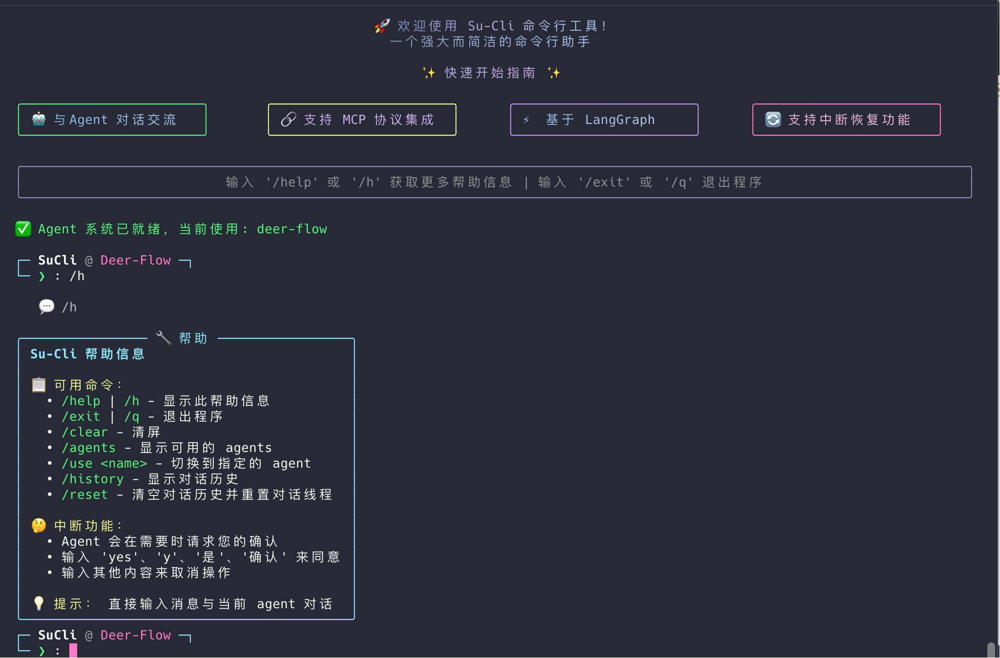
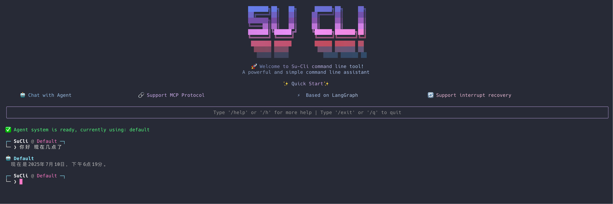

# Su-Cli 🚀

一个强大而简洁的命令行工具

## ✨ 特性

- 🎨 **美观的界面** - 使用 Rich 库打造的彩色命令行界面，支持多种主题风格
- 🤖 **多 Agent 系统** - 支持加载和切换不同功能的智能 Agent
- 🔄 **中断恢复** - 先进的中断确认机制，允许 Agent 在关键步骤暂停并请求用户确认
- 🖥️ **交互式设计** - 带有输入框的实时交互体验和流式响应
- 📋 **完整命令系统** - 内置帮助、历史记录、Agent 管理等丰富命令
- 💬 **对话管理** - 完整的对话历史记录和线程管理功能
- 🔧 **易于扩展** - 模块化设计，Agent 开发友好，支持标准化的中断协议
- ⚡ **现代工具** - 使用 uv 进行依赖管理，支持异步处理



## 🚦 快速开始

### 安装要求

- Python 3.10+
- uv (推荐的包管理器)

### 安装

1. 克隆项目：
```bash
git clone <repository-url>
cd su-cli
```

2. 使用 uv 安装依赖：
```bash
uv sync
```

### 运行

```bash
uv run main.py
```

## 📝 使用说明

启动 Su-Cli 后，您将看到美观的欢迎界面：



在命令提示符处，您可以：

### 内置命令

- `/help` | `/h` - 显示帮助信息
- `/agents` - 显示可用的 Agent
- `/use <name>` - 切换到指定的 Agent
- `/history` - 显示对话历史
- `/reset` - 清空对话历史并重置线程
- `/clear` - 清屏并重新显示欢迎界面
- `/exit` | `/q` - 退出程序

### Agent 系统

Su-Cli 支持多个智能 Agent，每个 Agent 都有专门的功能：

- **deer-flow** - 深度研究 Agent，支持中断确认功能
- **简单助手** - 基础对话 Agent

#### 🔄 中断恢复功能

部分 Agent（如 deer-flow）支持中断恢复功能，当需要用户确认时会暂停执行：

1. **自动检测**: 系统会自动检测 Agent 是否支持中断功能
2. **用户确认**: 出现确认提示时，输入 `yes`、`y`、`是`、`确认` 同意，其他输入取消
3. **继续执行**: 确认后 Agent 会从中断点继续执行

### 示例

```bash
Su-Cli > /agents                    # 查看可用 Agent
Su-Cli > /use deer-flow             # 切换到 deer-flow
Su-Cli > 研究量子计算的发展趋势        # 开始对话
# Agent 可能会显示计划并请求确认...
Su-Cli > /history                   # 查看对话历史
Su-Cli > /q                         # 退出程序
```

## 🛠️ 开发

### 项目结构

```
su-cli/
├── main.py          # 主程序文件
├── core/            # 核心模块
├── agents/          # Agent 目录
│   ├── deer-flow/   # deer-flow Agent
│   └── ...          # 其他 Agent
├── pyproject.toml   # 项目配置文件
├── README.md        # 项目说明文档
└── uv.lock         # 依赖锁定文件
```

### 依赖

- `rich` - 用于创建美观的命令行界面
- `langgraph` - 图工作流框架
- `langchain` - 语言模型集成框架

### 🔧 Agent 开发指南

#### 中断功能要求

如果您想开发支持中断恢复功能的 Agent，请遵循以下技术规范：

##### 1. 必需的函数结构

您的 Agent 必须提供两个图构建函数：

```python
# src/graph/builder.py 或 src/graph/__init__.py
from langgraph.checkpoint.memory import MemorySaver

def build_graph():
    """构建不带内存的图"""
    builder = StateGraph(State)
    # ... 添加节点和边
    return builder.compile()

def build_graph_with_memory():
    """构建带内存的图（支持中断恢复）"""
    memory = MemorySaver()
    builder = StateGraph(State)
    # ... 添加节点和边
    return builder.compile(checkpointer=memory)
```

##### 2. 中断处理格式

当用户确认时，系统会发送特定格式的命令：

```python
# 用户同意时
user_input = "[ACCEPTED] 用户确认继续执行计划"

# 用户拒绝时  
user_input = "[REJECTED] 用户拒绝执行计划"
```

**标准的处理代码示例：**

```python
async def your_node_with_interrupt(state: State):
    """包含中断确认的节点"""
    from langgraph.types import interrupt
    from langchain_core.messages import AIMessage
    
    # 触发中断，请求用户确认
    user_confirmation = interrupt({
        "message": "您的确认消息",
        "question": "您确认要处理这个请求吗？(yes/no)",
        "type": "confirmation"
    })
    
    # 标准格式处理
    confirmation_str = str(user_confirmation)
    if confirmation_str.startswith("[REJECTED]"):
        # 用户拒绝，返回取消消息
        return {
            "messages": [AIMessage(content="好的，我已取消处理这个请求。")]
        }
    elif not confirmation_str.startswith("[ACCEPTED]"):
        # 兼容旧格式：如果不是标准格式，按原有逻辑处理
        if confirmation_str.lower() not in ['yes', 'y', '是', '确认']:
            return {
                "messages": [AIMessage(content="好的，我已取消处理这个请求。")]
            }
    
    # 用户确认，继续处理逻辑
    # ... 您的处理代码
    return {"messages": [AIMessage(content="处理完成！")]}
```

##### 3. 响应输出格式

为确保正确的响应处理，请将最终输出放在以下字段之一：

```python
# 方式1: 标准 messages 格式
{
    "messages": [
        {"content": "您的响应内容"}
    ]
}

# 方式2: 特定字段格式  
{
    "final_report": "您的最终报告内容"
}

# 方式3: 其他支持的字段
{
    "content": "响应内容",
    "text": "文本内容"
}
```

##### 4. 目录结构要求

您的 Agent 应该按以下结构组织：

```
agents/your-agent/
├── src/
│   ├── graph/
│   │   ├── __init__.py      # 导出 build_graph_with_memory
│   │   └── builder.py       # 图构建逻辑
│   └── workflow.py          # 主工作流
└── ...
```

##### 5. 示例实现

参考以下 Agent 的实现，它们都是支持中断恢复功能的完整示例：

- **`agents/deer-flow`** - 高级研究 Agent，复杂的多节点工作流
- **`agents/a_simple_agent_quickstart`** - 简单聊天 Agent，基础的中断处理示例

两个示例都正确实现了标准的 `[ACCEPTED]`/`[REJECTED]` 中断协议。

#### 📋 测试中断功能

在开发过程中，您可以创建测试脚本来验证中断功能：

```python
from src.graph import build_graph_with_memory
from langgraph.types import Command

# 创建带内存的图
graph = build_graph_with_memory()

# 模拟中断恢复
config = {"configurable": {"thread_id": "test"}}
async for chunk in graph.astream(
    Command(resume="[ACCEPTED] 测试恢复"), 
    config=config
):
    print(chunk)
```

## 🤝 贡献

欢迎提交 Issue 和 Pull Request！

## 📄 许可证

本项目采用 MIT 许可证。

## 🎯 路线图

### ✅ 已完成
- [x] **多 Agent 系统** - 支持加载和切换不同的 Agent
- [x] **中断恢复功能** - 支持 Agent 中断和用户确认机制
- [x] **对话历史** - 完整的对话记录和管理
- [x] **美观界面** - Rich 库驱动的彩色命令行界面
- [x] **命令系统** - 完整的内置命令支持

### 🚧 开发中
- [ ] 添加配置文件支持
- [ ] Agent 热重载功能
- [ ] 更多界面主题

### 📋 计划中
- [ ] 添加插件机制
- [ ] 支持脚本执行
- [ ] 集成更多工具
- [ ] Web 界面支持
- [ ] Agent 性能监控

---

## ⚠️ 重要提示

### 🔄 Agent 中断功能开发

如果您正在开发新的 Agent 并希望支持中断恢复功能，**请务必遵循上述技术规范**：

1. **必须实现** `build_graph_with_memory()` 函数
2. **必须正确处理** `[ACCEPTED]` 和 `[REJECTED]` 格式的用户输入（**标准协议**）
3. **必须在合适的字段中** 返回响应内容（`messages`、`final_report` 等）

> 📋 **标准中断协议**: Su-Cli 使用统一的 `[ACCEPTED]` / `[REJECTED]` 格式作为 Agent 中断确认的标准协议。所有支持中断功能的 Agent 都应该遵循此协议，以确保与主程序的兼容性。

❌ **错误实现可能导致**：
- `Cannot use Command(resume=...) without checkpointer` 错误
- 中断恢复失败
- 用户确认无效

✅ **正确实现的参考**：
- 查看 `agents/deer-flow` 的完整实现
- 遵循本文档的技术规范
- 进行充分的中断功能测试

---

💡 **提示**: 这是一个正在快速发展的项目，更多功能即将推出！如有问题请提交 Issue。
